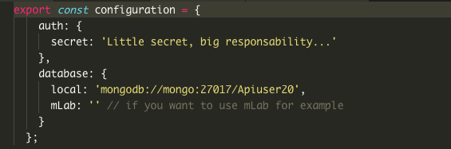
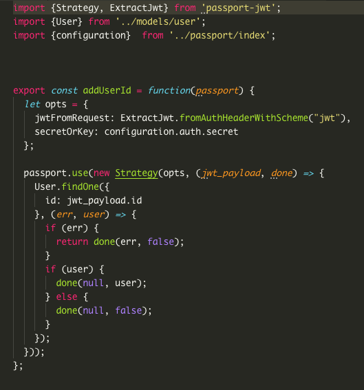
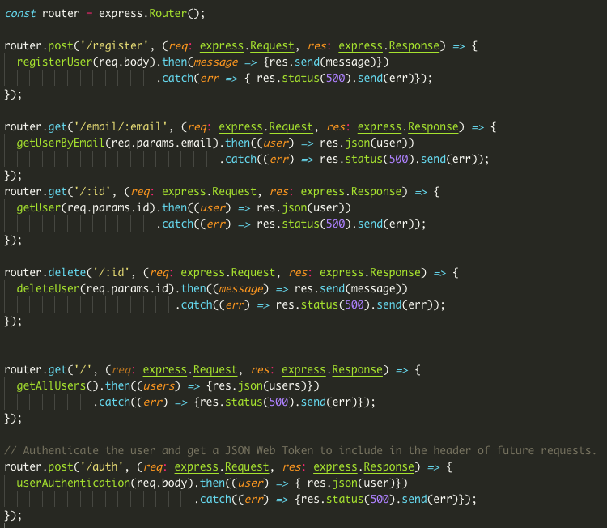
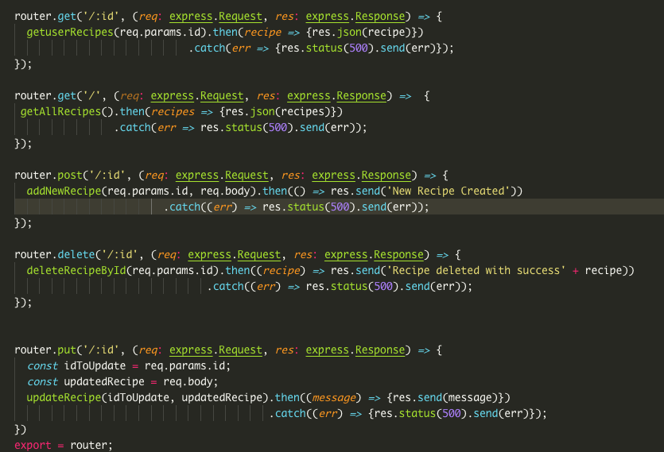

# Api
En este apartado vamos a comentar las funcionalidades de la api.

## Controller
En controller lo que encontramos son las diferentes funciones que utiliza la API para guardar datos dentro de la base de datos de Mongo. 

Para esta parte al utilizar TypeScript las funciones del controlador hacen uso de dos Helpers diferentes uno para usuarios `DTOUserHelpers.ts` y otro para recetas `DTORecipeHelper.ts` puesto que necesiamos garantizar la integridad de los datos. En estas funciones lo que se hace es limpiar los datos que vienen de la base de datos, quitando aquellos que no son necesarios y los cuales pueden comprometer la seguridad de los mismos.

## Modelos
Podemos encontrar dos modelos dentro de la carpeta models los modelos `recipe.ts` y `user.ts`.

### Recipe.ts

En este archivo va a ser el "Modelo" de nuestras recetas y de su respectiva DTO.
  
### User.ts

En este archivo vamos a encontrar el "Modelo" de usuarios y de su respectiva DTO.

## Passport 
Passport nos es un middleware que nos permite de manera sencilla gestionar la creación y autenticación de los ususarios de web. 

En nuestra carpeta passport encontrados archivos `index.ts` que se encarga de la pregunta secreta de passport y la conexión a la base de datos.

En `passport.ts` podemos encontrar una función que le agrega un id al usuario util mediante la función:

## Routes

En la carpeta `routes` podemos encontrar dos 3 carpetas las rutas principales de la api en `index.ts` las rutas de los usuarios en `users.ts` y  en `recipes.ts` podemos encontrar las rutas de recetas.

### Index.ts

Contiene un mensaje Welcome Home, indicando que es la raiz de la api.

### Users.ts

 Encontramos las rutas que que responden a la api a la hora de registrar y autentificar usuarios.

### Recipe.ts

Aquí encontramos las rutas de recetas, donde básciamente encontramos un CRUD de recetas y alguna petición más por si acaso nos fuera necesaria. 

## como configurar Server.ts

`Server.ts` contiene toda la info de configuración de nuestra API. En ella utilizamos dos middlewares principales como son Morgan y Passport del que ya hablamos antes. Además se establece la conexión con la base de datos de Mongo y se lanza la API en el puerto 3000 puesto que es el puerto por defecto que se utiliza con express. 