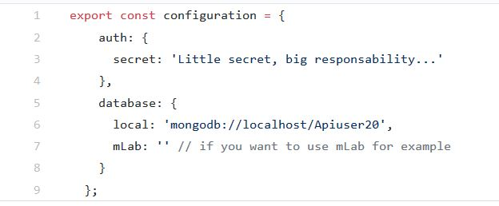
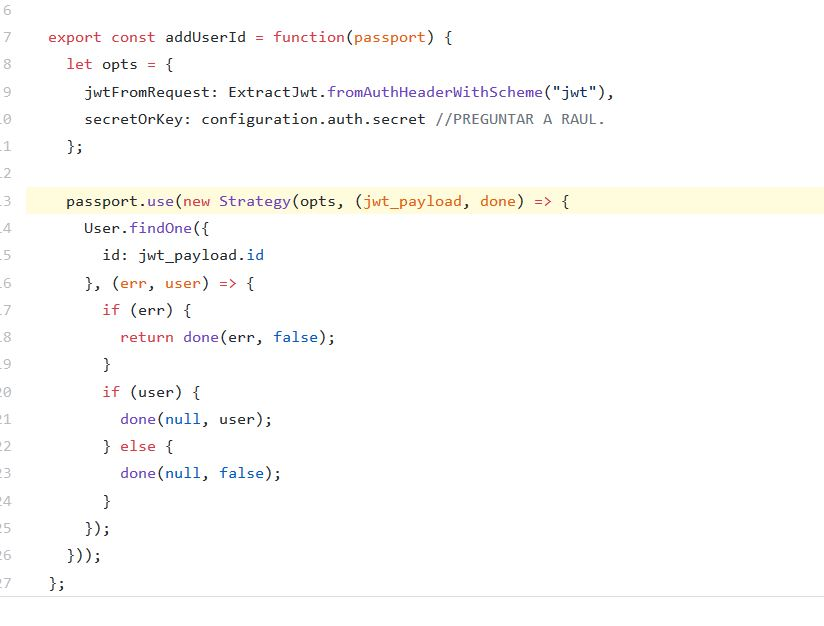
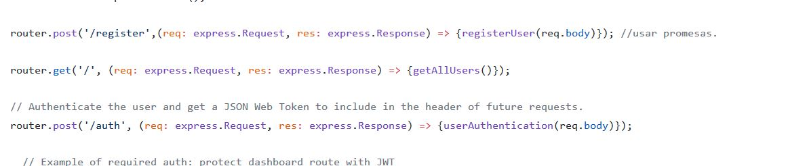

# Api
En este apartado vamos a comentar las funcionalidades de la api.

## Controller

## Modelos
Podemos encontrar dos modelos dentro de la carpeta models los modelos `recipe.ts` y `user.ts`.

### Recipe.ts

En este archivo va a ser el "Modelo" de nuestras recetas.
  
### User.ts

En este archivo vamos a encontrar el "Modelo" de usuarios.

## Passport 

En nuestra carpeta passport encontrados archivos `index.ts` que se encarga de la pregunta secreta de passport y la coneccion a la base de datos.

En `passport.ts` podemos encontrar una función que le agrega un id util mediante la función:

## Routes

En la carpeta `routes` podemos encontrar dos 3 carpetas las rutas principales de la api en `index.ts` las rutas de los usuarios en `users.ts` y  en `recipes.ts` podemos encontrar las rutas de recetas.

## Index.ts

De momento se encuentra vaciá pero esta por que lleve esta clase el mensaje de bienvenida la api.

## Users.ts

 Encontramos las rutas que que responden a la api a la hora de registrar y autentificar usuarios.

## Recipe.ts

Aquí encontramos las rutas de recetas.

## como configurar Server.ts
