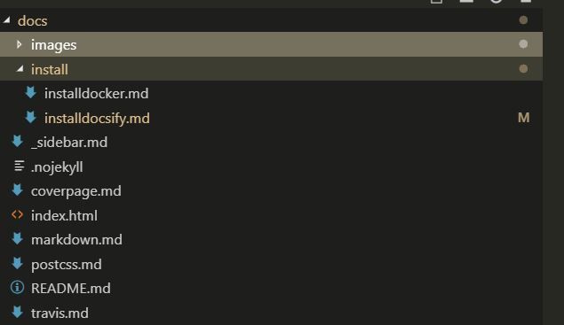
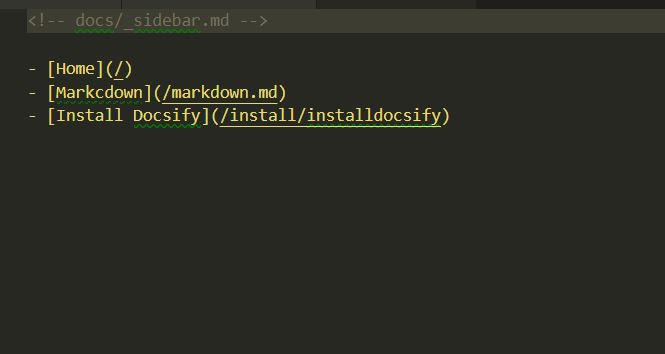

# Install docsify.

Para instalar docsify en nuestro proyecto tenemos que hacer.
`mpm install docisy-cli`

# Metodos de uso

A la hora de usar docsify tenemos la opción de poner los archivos directamente en la carpeta `docs` o crear subcarptas.

Para que estas carpetas se vean reflejadas en la pagina principal tenemos que poner en enlace a la nueva carpeta dentro de la vista principal tenemos que meternos en el archivo `_sidebar.md`.

